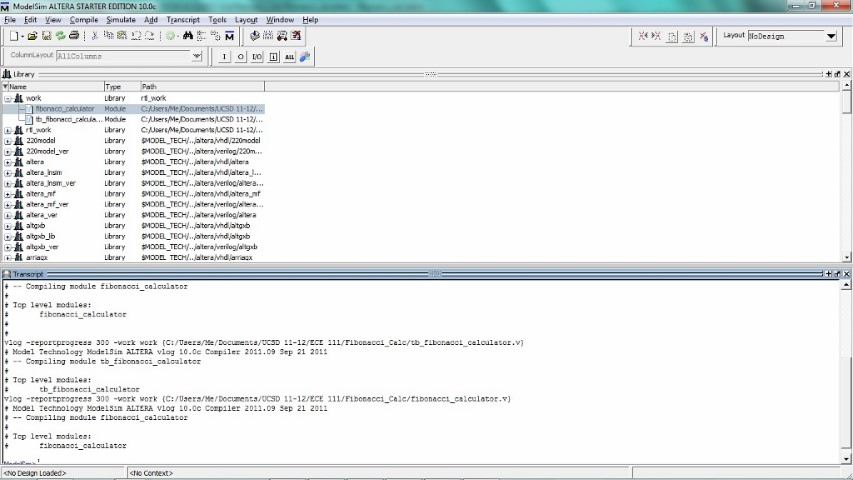
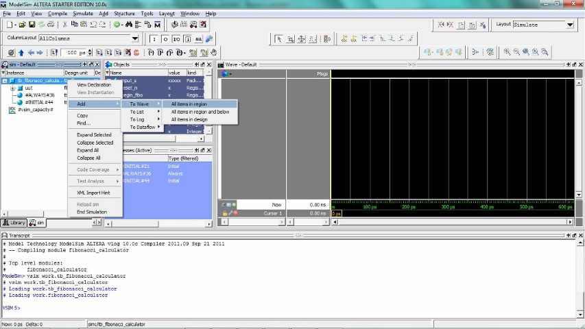
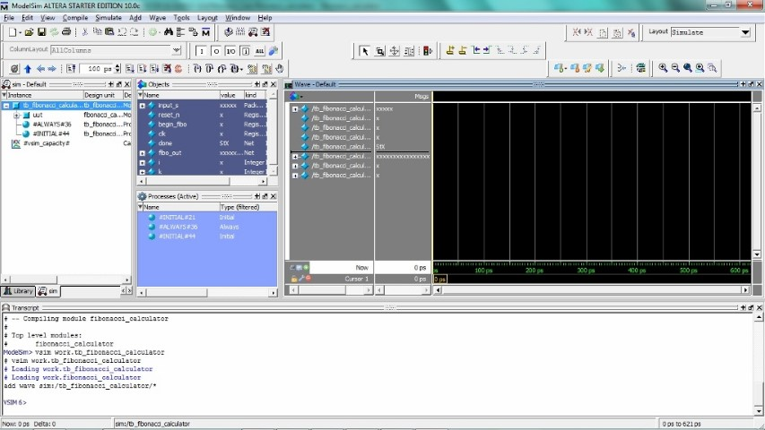
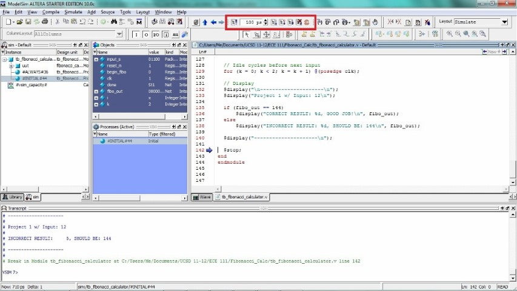
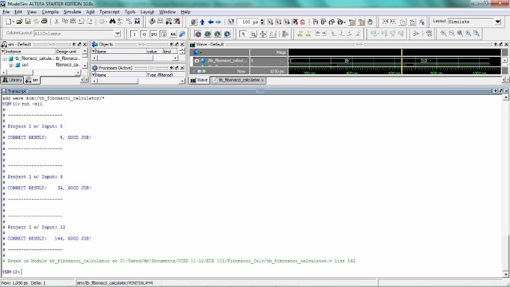

Installing Quartus
====

The following tutorial assumes that you using Windows and Google Chrome as your default browser. For other setups, the instructions below may not apply.

If you are using a mac, one option is to use BootCamp which enables you to dual-boot both Mac OS and Windows. You will need to download a windows ISO and obtian a valid windows key.

Make sure you have approximately 14GB of available disk space on your local disk.

Navigate to http://dl.altera.com/17.1/?edition=lite&platform=windows&download_manager=dlm3.
Create an account and make sure you are signed in.
Go back to the download page and under devices, uncheck all devices except for the Arria II model.

Next, disable any adblockers and click **download selected Files**.

If the settings in your browser are correct, the above window should show up. Click on where you want to download the setup files and press ok.

Navigate to your download folder and run QuartusLiteSetup-17.1.0.590-windows.exe.
Click Next and accept all agreements.

You will need to choose an installation directory. To make things easier, it is recommended to use the default directory. If you choose a directory with spaces such as Program Files there will be an extra step at the end, but do not worry if an error message pops up when this option is selected.

If all setup files were downloaded correctly, we get the above screen. If there are more devices that is OK as long as Quartus Prime or Modelsim are checked. Press next and Quartus Suite will be installed. Once the download is complete, you may delete the setup files in your download folder.

Uncheck USB Blaster II driver and launch quartus.

### For those who changed the default installation directory

In Quartus, try going into Tools-> Options -> EDA Tools options (Tools in the right hand corner.). Then check if Modelsim-Alteria doesn't have a path.

If this is the case, you will need to manually add the path to your ...\modelsim_ase\win32aloem folder. See https://www.altera.com/support/support-resources/knowledge-base/solutions/rd05172013_526.html.

The end result should look something like the above but varies slightly depending on the installation directory.
# Creating your first project: fibonnaci_calculator

#### Creating a directory for the project

Start by creating a folder that will contain both the fibonnaci_calculator.sv and tb_fibonnaci_calculator.sv files which can be found on the class website. In this class, any file starting with tb_ is designated a testbench file. In this case the testbench is used to run a module named fibonnaci_calculator hence the name tb_fibonnaci_calculator.sv.

You can save the files into the folder by copy-and-pasting the text into Quartus as it has a built in text editor that can be accessed through File->New..

Another way to do this is to pasting the text into your favorite text-editor (Atom/Sublime-Text/TextMate/Vim/etc). All text editors mentioned have downloadable packages that support the SystemVerilog language.

Double check the type is SystemVerilog HDL Files with Quartus (top) or All Files (\*.\*) with a .sv extension with other text editors (bottom).

Now, run Quartus and navigate to File -> Create a New Project. You should get the screen above. Click Next on the introductory page.

You will be asked to select a working directory for the project. Select the folder where the fibonnaci_calculator.sv and tb_fibonnaci_calculator.sv are saved. Be aware that you cannot have multiple projects in the same directory. If you have a directory for this class, there should be sub-folders for each project.

**The name of the project has to match the name of the top,non-testbench module in the project.** For example, in the above screenshot the project name is fibonnacci_calculator because fibonnaci_calculator.sv declares the module fibonnaci_calculator.

Once this section is complete, select Next.

The next page asks if you want to use a previous template for your design. For most purposes this should be left as empty project. Click Next as this is the default.

The next screen allows you to add files to the project. For most cases it suffices to click Add All. After you have selected the files to add press Next. You may come back to this screen after you create the project from the homescreen by clicking Project-> Add/Remove Files.

Designing hardware relies on the capability of each FPGA. In this class, we will be using:

Family: **Arria II GX**

Device: **EP2AGX45DF29I5**

Scroll down using the arrow pointing downwards on the bottom right. Be sure to **select EP2AGX45DF29I5** otherwise your area and timing numbers will be incorrect. Press Next.

Next to Simulation, under Tool Name click on **ModelSim-Altera** and under format click **SystemVerilog HDL** then press next.

On the next screen it will display a summary of your settings. Press Finish

Now that we have created the project, under **Compilation Hierachy** double click **fibonnaci_calculator**. It will open the file containing the top module which in this case is fibonnaci_calculator.sv.

## Compiling fibonnaci_calculator.sv in Quartus

Now, double click on **Analysis & Synthesis** under the Tasks pane. This will compile and synthesize your program(s). If there are no errors, you will see a pop-up saying the Analysis & Compilation was successful. If not, it will tell you your errors in the Messages pane at the bottom of the screen. It is good habit to just review your warnings (if any) to ensure you have no latches or other design hazards.

## Running the Testbench and Displaying Signals Through ModelSim

Once the Analysis & Synthesis is successful, we can open up ModelSim to test our code. Go to Tools -> Run Simulation Tool -> RTL Simulation. Make sure that ModelSim is not already running or there will be an error.

Go to <b>Compile</b>--&gt;<b>Compile</b>. Ensure that the <b>Library</b> is <b>work</b> and you are in your project's directory. Many times you will have to change directories
so that you are in your project's directory. Select all SystemVerilog HDL Files that pertain to your project. This includes the testbench. Hit <b>Compile</b> and then <b>Done</b>.

If you look at the bottom in the <b>Transcript</b> pane, you will see that it did compile and there were no errors. The <b>work</b> library should have all the files you
just compiled. If not, repeat the previous step. Since the testbench does the signal generations and testing, double click on your testbench file. If the transcript does not show up after compiling, go to Layout -> NoDesign and it should show up.

ModelSim will slowly load new panes to look like below. If you do not see the <b>Wave</b> pane, do not worry as you will show it in later steps. You should see something
similar to below.

The next step is to add signals to the wave and show the wave if it is not already present. On the left, in the <b>sim</b> pane, right click on the testbench file which should
be the top most file. Go to <b>Add</b>--&gt;<b>To Wave</b>--&gt;<b>All items in region</b>.

In the <b>Wave</b> pane, you will see all the signals declared and used in the testbench.

When dealing with signals that are many bits, it is easier to see its value as an unsigned integer rather than binary. To make this conversion, right click on the signal you
want, go to <b>Radix</b> and choose the format you want. Unsigned integer is the radix you will use for this class.

You are now ready to simulate your program. The icons boxed in the below screenshot are used to run the testbench. The first icon is <b>Restart</b> which will reset the simulation
as if you never ran it. This is helpful to rerun the simulation without recompiling everything. The <b>Run Length</b> allows you to enter a specific amount of time you want the
program to run for. It defaults to pico-seconds, but nano-seconds is the best time to use. The icon <b>Run</b> right after the <b>Run Length</b> is to run your program for the
amount of time specified in the <b>Run Length</b>. If you set <b>Run Length</b> to be 10 ns, each time you press <b>Run</b>, the program will continue for 10 ns. <b>Continue Run</b>
will run the program until it terminates. The same is true for <b>Run -All</b>. All the programs in this class will terminate in less than one second. If you find yourself waiting
for longer than a few seconds until the program terminates, hit the <b>Stop</b> button and recheck your logic. you will see the following screen once your program terminates. It
shows you where the program terminated. To go back to the <b>Wave</b>, click on the <b>Wave</b> tab.

You should see something like this on your <b>Wave</b>.

If you expand or scroll through the <b>Transcript</b> pane, notice the "CORRECT RESULT" text along with outputs of the tb_fibonnaci_calculator.sv. The transcript plane will also show the output of any $display statements you have in your code. The above script generated by the testbench indicates that fibonnaci_calculator.sv was a success.

## Checking Area and Fmax Through Quartus

Now that our code is confirmed to be correct, it is useful go back to Quartus to check the Area and the clock frequency (Fmax).

### Checking Fmax

Double click TimeQuest Timing Analysis under **Tasks**.  This will run Fitter (Place & Route) as well.

In the Table of Contents of the **Compilation Report** expand **TimeQuest Timing Analyzer**. Then expand **Slow 900mV 100C Model** and look at Fmax Summary. The speed of your clock is given by Fmax.

### Checking Area

In the Table of Contents of the **Compilation Report** expand **Fitter** and then Summary. Under Fitter Summary, double click **Logic utilization**. Area is the sum of Combinational ALUTS and Dedicated logic registers. In this class, Memory ALUTs must be 0.
